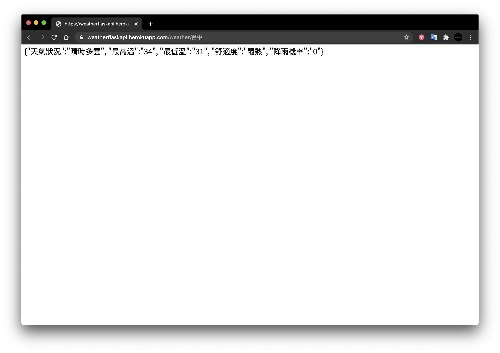
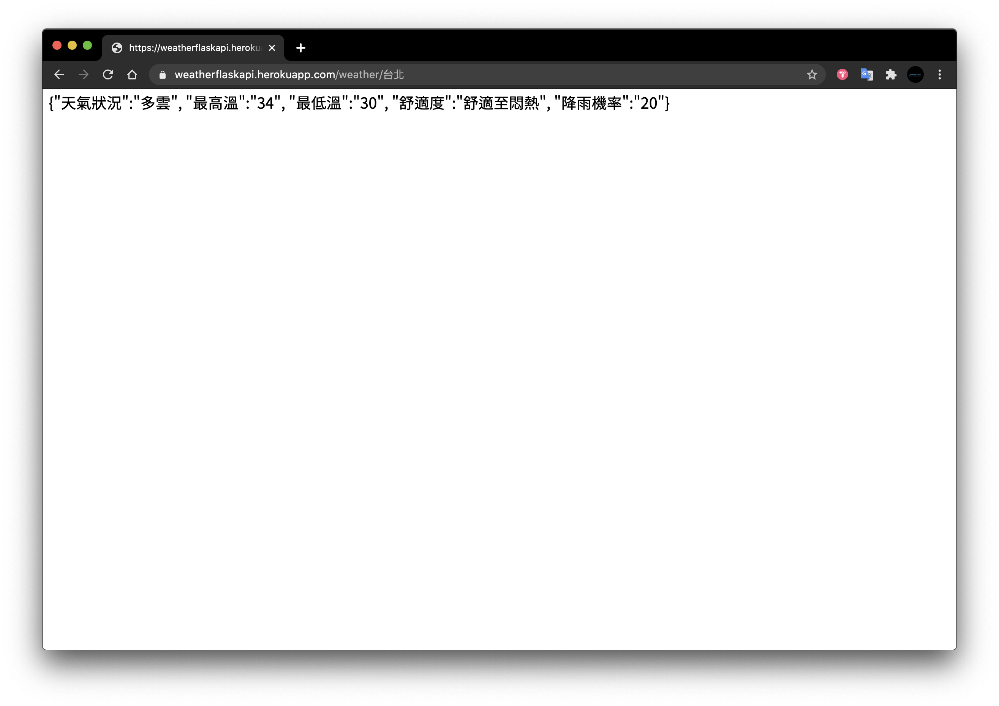
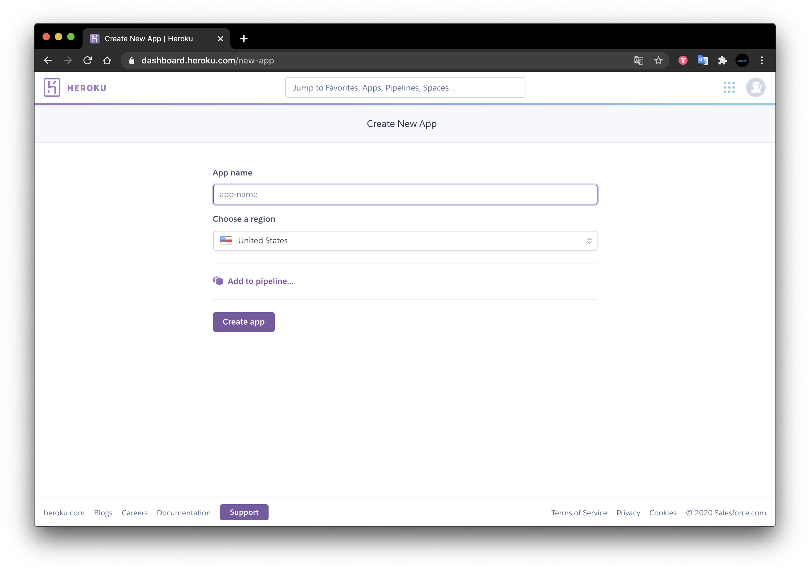
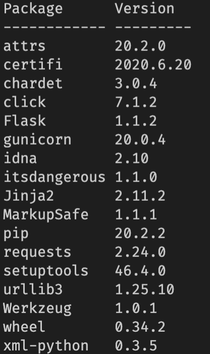
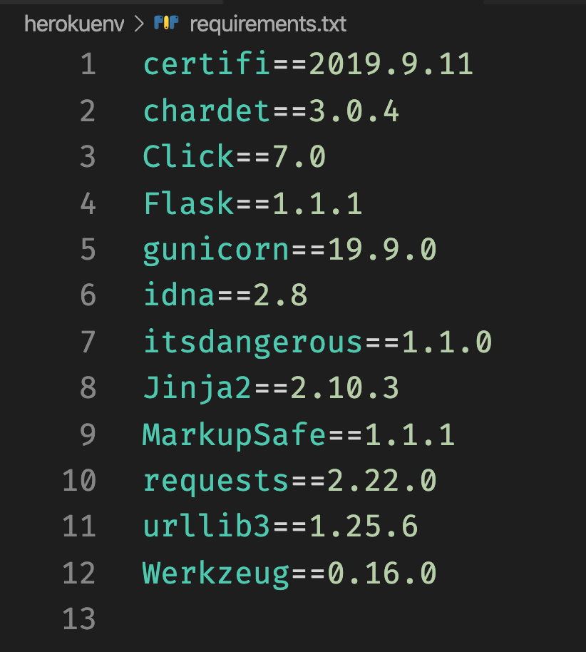
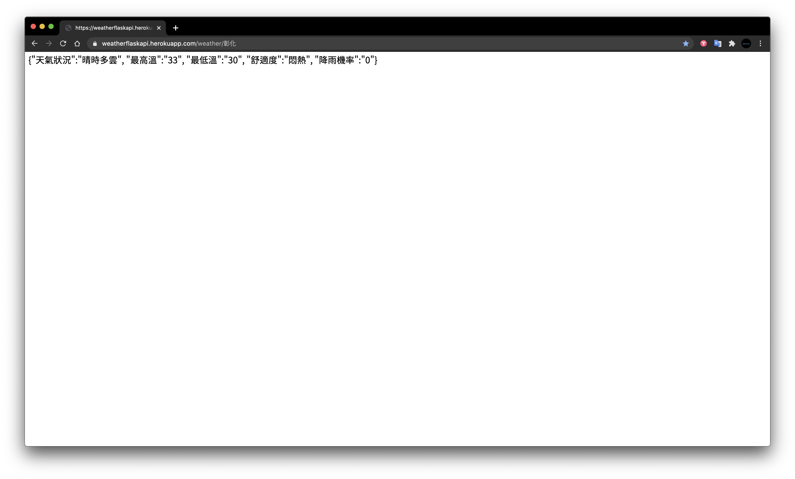

# Flask web API 取得台灣氣象局公開資料
##### pip install flask
weather.py

取得台中資料

取得台北資料

# web API部署到網頁伺服器
##### heroku 利用 git 進行部署
1.下載 git for win / for mac
https://git-scm.com/ 

2.設定
git config --global user.name"user name"
git config --global user.email"user e-mail"

3.create new app

###### pip install flask
###### pip install gunicorn
###### pip install requests
##### pip list

# Heroku 必須包含
1. requirements.txt

2. runtime.txt 

3. Procfile

# Push to Heroku
1. (*)heroku login 
2. git init
3. heroku git:remote -a app-name_on_heroku
4. (*)git add . 
5. (*)git commit -m 'msg'
6. (*)git push heroku master
##### (*)更新程式使用

# heroku 呈現資料

# https://weatherflaskapi.herokuapp.com/weather/%E5%BD%B0%E5%8C%96